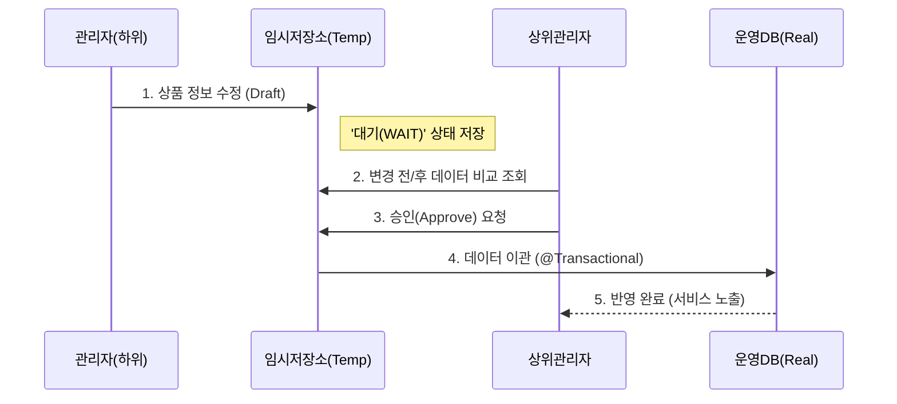
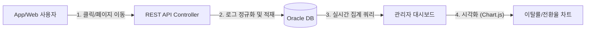

# BNK Card 프로젝트

**AI 기반 부산은행 카드 발급 및 관리 플랫폼**

Spring Boot, Flutter, Oracle, Python 기반의 하이브리드 금융 서비스입니다.  
카드 발급, 본인 인증, 커스텀 카드, 챗봇, 피드백 분석 등 다양한 기능을 포함하고 있습니다.

---

## 1. 프로젝트 개요

**BNK Card**는 사용자의 카드 신청부터 발급, 관리까지의 모든 과정을 디지털로 통합한 모바일 금융 서비스입니다.  
AI 기술을 활용해 신분증 인증, 이미지 검열, 피드백 감정 분석을 자동화하였으며,  
**REST API 기반의 확장성 있는 아키텍처**와 **자체 데이터 분석 시스템**을 통해 운영 효율성을 극대화했습니다.

**프로젝트 핵심 목표**
- 안전하고 효율적인 카드 발급 절차 구현  
- **데이터 무결성을 보장하는 관리자 승인 프로세스 구축** (Admin Core)
- **외부 툴 없는 자체 사용자 행동 분석 시스템 구현** (Data Analytics)

**웹 메인페이지** 

---

## 2. 기술 스택

| 구분 | 사용 기술 |
|------|------------|
| **Frontend** | Flutter (App), HTML/JS/Chart.js (Admin) |
| **Backend** | **Spring Boot (Java 21)**, MyBatis |
| **Database** | **Oracle Database 19c** (PL/SQL, Triggers) |
| **AI Server** | Python (FastAPI, YOLOv8, EasyOCR, FaceNet) |
| **Infra/기타** | Gradle, Lombok, WebSocket/STOMP, SSE, OpenAPI |

---

## 3. 아키텍처 구성

**"One Backend, Multi-Client Strategy"**  
Web과 App이 하나의 Spring Boot REST API를 공유하여 데이터 통합 관리 및 확장성을 확보했습니다.

[Flutter App] ↔ [Spring Boot Server] ↔ [Oracle DB] 
&nbsp;&nbsp;&nbsp;&nbsp;&nbsp;&nbsp;&nbsp;&nbsp;&nbsp;&nbsp;&nbsp;&nbsp;&nbsp;&nbsp;&nbsp;&nbsp;&nbsp;&nbsp;&nbsp;&nbsp;&nbsp;&nbsp;&nbsp;&nbsp;&nbsp;&nbsp;&nbsp;&nbsp;&nbsp;&nbsp;&nbsp;&nbsp;↕ 
&nbsp;&nbsp;&nbsp;&nbsp;&nbsp;&nbsp;&nbsp;&nbsp;&nbsp;&nbsp;&nbsp;&nbsp;&nbsp;&nbsp;&nbsp;&nbsp;&nbsp;&nbsp;&nbsp;&nbsp;&nbsp;[Admin Web Dashboard] 
↘ (HTTP/REST) 
[Python AI Server] 
├── OCR 및 얼굴 인식 검증 
└── 이미지 검열 (YOLO)

---

## 4. 주요 기능

| 구분 | 기능 설명 |
|------|------------|
| **회원 및 보안** | 주민등록번호 + 얼굴 인식 기반 본인 인증, 로그인/세션 관리 |
| **카드 발급 절차** | 약관 동의 → 정보 입력 → AI 인증 → 배송지 입력 → 전자서명 |
| **관리자 시스템** | **(Core)** 상품 승인/반려, 이탈률 분석, 실시간 통계 리포트 |
| **커스텀 카드** | 텍스트, 배경, 이모티콘 편집 및 AI 이미지 검열 기능 |
| **챗봇/피드백** | AI 감정 분석을 통한 긍정/부정 리뷰 분류 및 상담 지원 |
| **위치 기반** | GPS 기반 영업점 검색, 거리순 추천 및 지도 표시 |

---

## 5. AI 기능 요약

| 기능 | 설명 |
|------|------|
| **YOLOv8 이미지 검열** | 커스텀 카드 이미지 내 부적절(총기, 음란물 등) 콘텐츠 자동 탐지 |
| **OCR + 얼굴 인식** | 신분증의 주민번호 인식(OCR) + 실시간 얼굴 비교로 본인 확인 |
| **감정 분석** | 사용자 피드백을 자연어 처리 기반으로 긍정/부정 분류 및 키워드 통계 생성 |

---

## 6. UX 설계 원칙

- **핀테크 스타일 UX**: 단순하고 명확한 시각 구조  
- **탐색 효율성**: 해시태그 기반 카드 검색 (#카페, #쇼핑 등)  
- **즉시 피드백**: 실시간 입력 검증 및 인라인 에러 메시지  
- **약관 UX**: 전체 스크롤 완료 후 동의 버튼 활성화  
- **자동화 입력**: 로그인 정보 기반 오토필, 민감정보 마스킹  

---

## 7. 역할 분담

| 이름 | 담당 기능 |
|------|------------|
| **이대영** | **Admin Core, 승인 프로세스, 자체 데이터 분석, API 설계** |
| **김성훈 (PL)** | AI 이미지 검열, SSE 푸시 알림, 리뷰 피드백 분석 |
| **수현** | 회원 및 상품 관리, 약관 뷰어, PDF/Excel 보고서 |
| **창훈** | 카드 발급 프로세스, 단계별 통계, UX 설계 |
| **민수** | 위치 기반 영업점 안내, 커스텀 카드 UI |

---

## 8. 관리자 기능 요약

| 기능 | 설명 |
|------|------|
| **고객 관리** | 개인정보, 신청 내역, 이탈률 추적 |
| **약관 관리** | PDF 업로드, 사용 여부 전환, 버전별 관리 |
| **추천 상품 관리** | 클릭/신청 통계 기반 추천 카드 운영 |
| **리포트** | Excel/PDF 내보내기, 기간별 발급 통계 |
| **이탈률 분석** | 각 단계별 전환율/이탈율 시각화 그래프 제공 |

 

<!-- ✨ Deep Dive 섹션 시작 (이대영 담당 상세) -->
## 8-1. [Deep Dive] 관리자 시스템 기술 구현 (담당: 이대영)

저는 본 프로젝트에서 **금융 데이터의 무결성을 보장하는 승인 프로세스**와 **보안을 고려한 자체 데이터 분석 시스템**을 전담하여 설계 및 구현했습니다.

### 📌 A. 금융 데이터 승인 프로세스 (Maker-Checker System)
> **"운영자의 실수가 금융 사고로 이어지지 않도록 안전장치를 마련하다."**

*   **문제:** 관리자가 실수로 카드 연회비나 혜택을 잘못 수정하여 즉시 앱에 반영될 경우 금전적/법적 리스크 존재.
*   **해결:** **수정(Draft) → 검수(Review) → 승인(Approve)**의 3단계 승인 체계 도입.

### 📌 B. 자체 구축 사용자 행동 분석 (In-house Analytics)
> **"Google Analytics 없이, 금융 보안을 고려한 자체 로그 파이프라인 설계"**

*   **문제:** 금융 상품 관심 정보 등 민감한 사용자 데이터를 외부(Google) 서버로 전송하는 보안 리스크.
*   **해결:** **DB 기반의 자체 로그 수집 시스템** 구축. Web(1차)에서 App(2차)으로 확장 시, **REST API** 구조를 통해 서버 코드 수정 없이 로그 수집 채널을 통합했습니다.

<!-- ✨ Deep Dive 섹션 끝 -->

---

## 9. 성과 및 개선 사항

**성과**
- AI 기술(OCR, 얼굴 인식, 감정 분석, YOLO)을 실무 서비스에 적용  
- 사용자 UX와 금융 보안을 함께 고려한 설계  
- 관리자/사용자 통합 환경 완성  
- **REST API 아키텍처를 통한 Web/App 멀티 플랫폼 지원 및 데이터 승인·분석 시스템 구축 (Admin Core)**

**개선 방향**
- AI 데이터셋 확장 및 모델 정밀도 향상  
- SSE 기반 실시간 이벤트 및 알림 시스템 고도화  
- UI 일관성, 클라이언트 유효성 검증 강화  

---

## 10. 프로젝트 결과 및 배운 점

- 카드 발급 절차를 실제 구현하며 금융 서비스 전반의 흐름 이해  
- AI 기술을 서비스 맥락에 통합하며 실무 적용 가능성 체감  
- **관리자 관점의 데이터 분석 및 운영 프로세스 설계 경험 확보 (승인 프로세스, 로그 분석)**
- **외부 솔루션 없이 자체적으로 시스템을 구축하며 데이터 주권 및 보안의 중요성 체감**

---

## 11. 실행 환경 요약

| 항목 | 설정 |
|------|------|
| **Spring Server** | http://localhost:8090 |
| **AI Server (Chatbot)** | http://localhost:8000 |
| **AI Server (YOLO)** | http://localhost:8001 |
| **DB 연결** | Oracle XE (로컬/도커) |
| **Flutter 앱 테스트** | Android Emulator / Web |
| **Admin Web** | http://localhost:8090/admin |

---

## 12. 디렉토리 구조
Spring  

---

## 13. 향후 계획

- 실사용 데이터 기반 AI 학습 정밀도 향상  
- 사용자 이벤트 기반 실시간 알림 및 리텐션 기능 강화  
- SSE 채널 표준화 및 운영자 대시보드 구축  
- 피드백 자동 반영 및 A/B 테스트 연동  

---

**Last Updated:** 2025.10  
**Author:** 김성훈 (AI/Backend Developer) & **이대영 (Admin Core Developer)**
